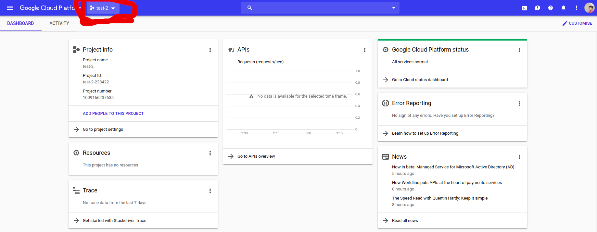
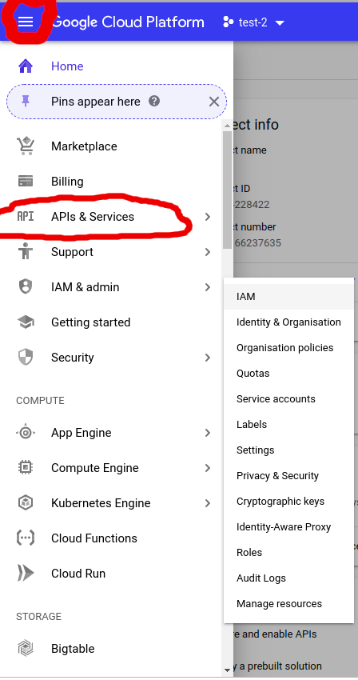
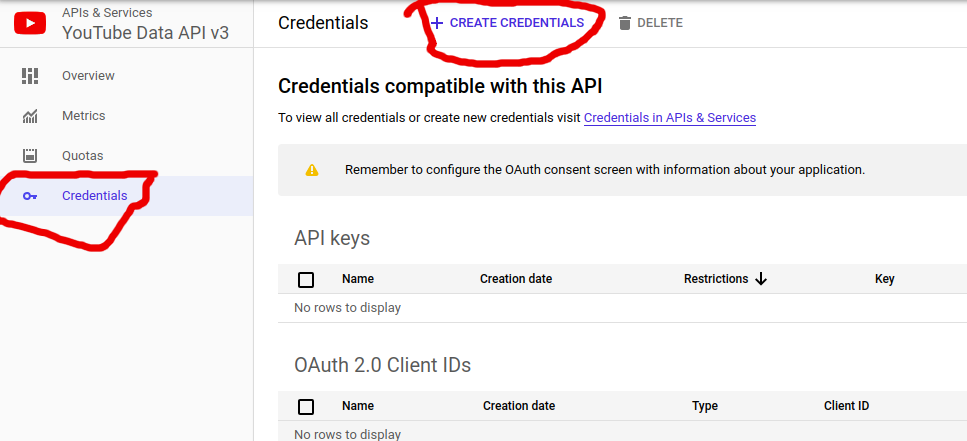
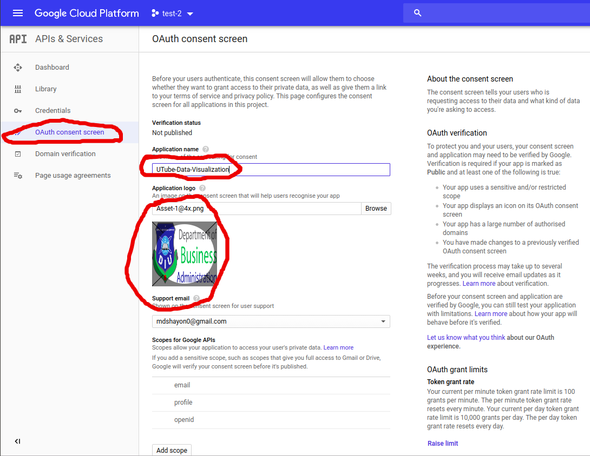
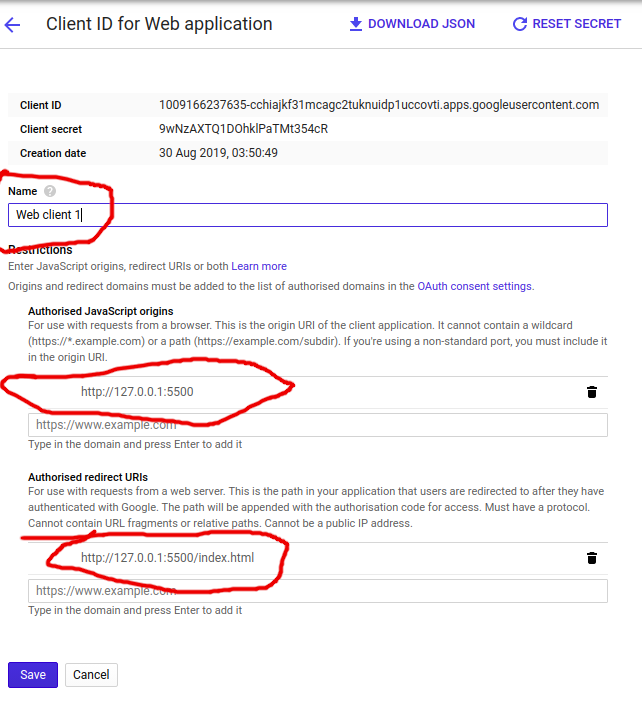

# Vanilla Javascript Youtube API

[tutorial](https://www.youtube.com/watch?v=r-yxNNO1EI8)

gedit README.md

write **googe conlose cloud** and Search on google [See](https://console.cloud.google.com/home/dashboard?project=test-2-228422&folder=&organizationId=)

Create A Project

 

 

API Library ->

 

Enable it

 

OAuth Client ID

Configure OAuth Concent Screen

 

And Save

 

 

 

 # CSS  Distribution

This repository is automatically synced with the main [Semantic UI](https://github.com/Semantic-Org/Semantic-UI) repository to provide lightweight CSS only version of Semantic UI.

This package **does not support theming** and includes generated CSS files of the default theme only.

You can view more on Semantic UI at [LearnSemantic.com](http://www.learnsemantic.com) and [Semantic-UI.com](http://www.semantic-ui.com)

